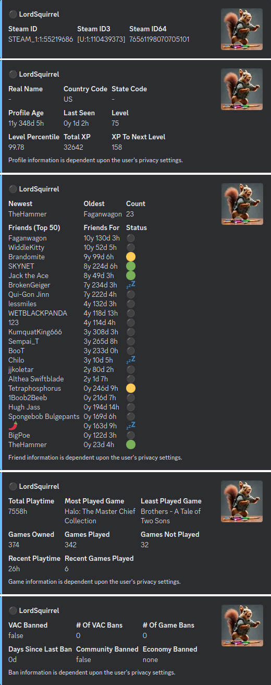

  
  <h2 >Steam Stats</h2>

Steam Stats is a Discord bot designed to enrich your gaming community with detailed Steam profile statistics. Whether you're looking to showcase your game library, track friends list status, monitor account bans, or access profile and ID information, Steam Stats Bot provides all the data you need directly in your Discord server.

