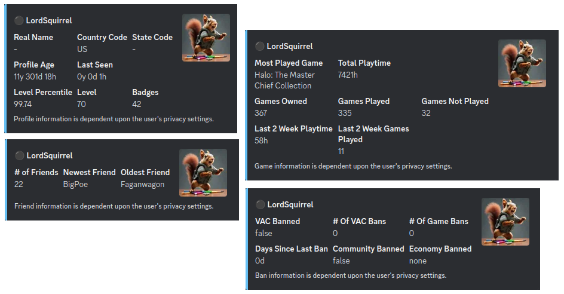

    <h2>steam-stats</h2>
    
 A Discord bot that enhances your gaming community by providing detailed Steam profile statistics. Whether you want to showcase your game library, check your friends list status, or monitor account bans, Steam Stats Bot delivers all the information you need right within your Discord server.

    
    
    

 

