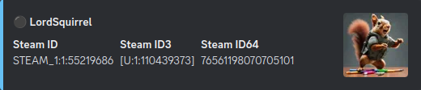
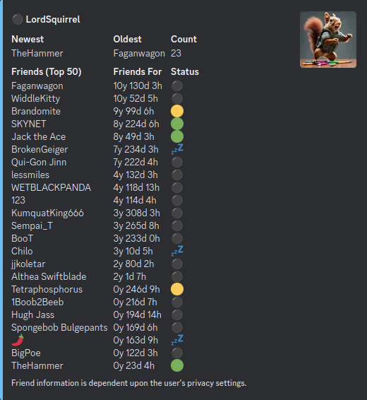
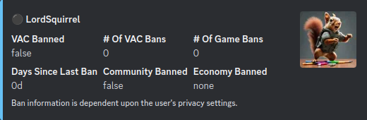
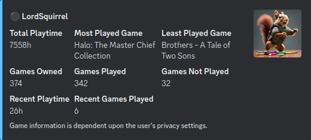

## Steam Stats

Steam Stats is a Discord bot designed to enrich your gaming community with detailed Steam profile statistics. Whether you're looking to showcase your game library, track friends list status, monitor account bans, or access profile and ID information, Steam Stats Bot provides all the data you need directly in your Discord server.

## Commands

#### help

`!stats help` or `!stats`

```
Usage:
    !stats [command] [Steam ID, Steam ID3, Steam ID64, Steam URL]

Commands:
    help       Prints information about the Steam Stats bot
    profile    Prints information about a user profile
    friends    Prints information about a users friends list
    games      Prints information about a users game library
    bans       Prints ban informaton about a user
    id         Prints various Steam IDs for a user

Examples:
    !stats profile [U:1:110439373]
    !stats profile 76561198070705101
    !stats profile STEAM_1:1:55219686
    !stats profile https://steamcommunity.com/id/TheLordSquirrel/
```
#### ID
`!stats id https://steamcommunity.com/id/TheLordSquirrel/`



#### Profile
`!stats profile https://steamcommunity.com/id/TheLordSquirrel/`


#### Friends
`!stats friends https://steamcommunity.com/id/TheLordSquirrel/`



#### Bans
`!stats bans https://steamcommunity.com/id/TheLordSquirrel/`



#### Games
`!stats games https://steamcommunity.com/id/TheLordSquirrel/`



